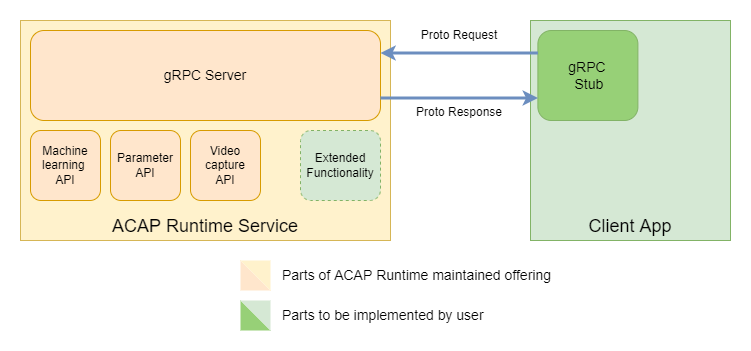

*Copyright (C) 2022, Axis Communications AB, Lund, Sweden. All Rights Reserved.*

<!-- omit in toc -->
# BETA - ACAP runtime

[](https://github.com/marketplace/actions/super-linter)
[](https://github.com/AxisCommunications/acap-runtime/actions/workflows/docker-image.yml)

ACAP runtime is a network protocol based service, using [gRPC][gRPC] and Unix
Domain Socket (UDS) for access. This makes the service available to clients
written in different languages on the same device.

If you are new to the world of ACAPs take a moment to check out
 [What is ACAP?][acap-documentation] in the ACAP documentation.

<!-- omit in toc -->
## Table of contents

- [Overview](#overview)
  - [Requirements](#requirements)
  - [APIs](#apis)
  - [gRPC access point](#grpc-access-point)
  - [TLS](#tls)
- [Installation and usage](#installation-and-usage)
  - [As an ACAP application](#as-an-acap-application)
  - [As containerized version](#as-containerized-version)
  - [Configuration](#configuration)
- [Building ACAP runtime](#building-acap-runtime)
  - [Building as an ACAP application](#building-as-an-acap-application)
  - [Building as a containerized version](#building-as-a-containerized-version)
- [Test suite](#test-suite)
- [Contributing](#contributing)
- [License](#license)

## Overview

ACAP runtime provides a network protocol based service, using gRPC to
expose a number of [APIs](#apis). Once started, ACAP runtime runs a gRPC server
that can be accessed by a client app, written in any gRPC compatible language.
For further information on the gRPC protocol and how to write gRPC clients see
[https://grpc.io/][gRPC].



ACAP runtime can be installed on a device as a standard native ACAP application.
Additionally it is available in a containerized version, i.e. it can run as a
container on the device.
The former case is mainly suitable for use together with the
[ACAP Native SDK][acap-documentation-native], whereas the latter is aimed to be
used together with the [ACAP Computer Vision SDK][acap-documentation-cv] and
requires that [Docker ACAP][docker-acap] is installed on the device. The
containerized version provides more configuration options. This is further
described in the respective Configuration sub sections in the
[Installation and usage](#installation-and-usage) section.

> **Note**
>
> The ACAP runtime service can run either with TLS authenticated or without.
> Be aware that running without TLS authentication is extremely insecure and we
strongly recommend against this.
> See [TLS](#tls) for information on how to generate certificates for TLS
authentication when using ACAP runtime.

### Requirements

The following requirements need to be met.

- Axis device:
  - ACAP runtime as an ACAP application can be installed on any device that the
  ACAP Native SDK supports. See [Axis devices & compatibility][devices] for
  more information.
  - ACAP runtime's containerized version also requires [Docker ACAP][docker-acap]
  to be installed and running.
  - Certificate files if [TLS](#tls) is used.

- Computer:
  - Either [Docker Desktop][dockerDesktop] version 4.11.1 or higher, or
  [Docker Engine][dockerEngine] version 20.10.17 or higher, with BuildKit enabled.

### APIs

The ACAP runtime service provides the following APIs:

- Inference API - An implementation of [Tensorflow Serving][tensorflow].
- Parameter API - Provides gRPC read access to the parameters of an Axis device
that otherwise would be read out via [VAPIX][vapix]. There are usage examples
available for the parameter API in [Python][parameter-api-python] and
[C++][paramter-api-cpp].

## Installation and usage

### Installation

Both variants of ACAP runtime, the native ACAP application and the containerized
version are available as pre-built images on [Docker Hub][docker-hub-acap-runtime].
These images are the recommended way to install and use ACAP runtime.

#### Native ACAP application

To install use any image from [axisecp/acap-runtime][docker-hub-acap-runtime] with
a tag on the form `<version>-<ARCH>`, e.g. `latest-armv7hf`.
Running the image installs ACAP runtime as an ACAP application on the device,
where it can be controlled in the device GUI **Apps** tab.

```sh
# Install the latest prebuilt image
docker run --rm axisecp/acap-runtime:latest-<ARCH> <device IP> <device password> install
```

Where `<ARCH>` is either `armv7hf` or `aarch64` depending on device architecture,
`<device IP>` is the IP address of the device and `<device password>` is the
password for the root user.

The application can then be started either in the device GUI **Apps** tab or by running:

```sh
docker run --rm axisecp/acap-runtime:latest-<ARCH> <device IP> <device password> start
```

The application log can be found by clicking on the **App log** in the
application drop down menu in the device GUI, or directly at:

```sh
http://<device_ip>/axis-cgi/admin/systemlog.cgi?appname=acapruntime
```

The application can be stopped and uninstalled by using the device GUI, or by running:

```sh
docker run --rm axisecp/acap-runtime:latest-<ARCH> <device IP> <device password> stop
docker run --rm axisecp/acap-runtime:latest-<ARCH> <device IP> <device password> remove
```

#### Containerized version

Whereas the standard ACAP runtime Docker image will install the service as an ACAP
application, the containerized version allows to run it in a container on the device.
This requires that [Docker ACAP][docker-acap] is installed and running on the device.

Pre-built containerized images are available on
[axisecp/acap-runtime][docker-hub-acap-runtime] with tags on the form
`<version>-<ARCH>-containerized`.
To include the containerized ACAP runtime server in a project, add the image in
the projects `docker-compose.yml` file. The following is an illustrative
example of how the service can be set up with docker-compose. Here we use the
image for `armv7hf`architecture. For a complete description
see one of the working project [examples](#examples-1).

```yml
version: '3.3'
services:
    acap-runtime-server:
      image: axisecp/acap-runtime:latest-armv7hf-containerized
      entrypoint: ["/opt/app/acap_runtime/acapruntime", "-o", "-j", "4"]

    acap-runtime-client:
        image: <client app image>
        environment:
            - INFERENCE_HOST=unix:///tmp/acap-runtime.sock
            - INFERENCE_PORT=0
    <any other apps>
```

#### Configuration

#### Native ACAP application

To change the configuration of the ACAP runtime service, use the settings in the
application drop down menu in the device GUI. Note that the application need to
be restarted for any changes to take effect.

The available settings are:

```text
Verbose     Enable extended logging, default 'No',
IpPort      IP port of gRPC server. See note1,
Use TLS     Enable SSL/TLS, default 'Yes'. See note2,
ChipId      Chip id used by Inference API server. See note3.
```
Notes.

**(1)** The gRPC server can be set up with either a unix-socket (default) or a
network socket. To set up as network socket IpPort should be set to a non-zero
value. The IP address of the socket will then be 0.0.0.0:<IpPort>.
See [gRPC](#grpc-socket) for more information.

**(2)** To use TLS a certificate file and a corresponding private key file must
be supplied. If either is omitted, or if the device setting Use TLS is set to 'No',
TLS is not used.
See [TLS](#tls-1) for more information.

**(3)** When using the Inference API, the chip Id corresponding to the device must
be given. See [Chip id](#chip-id) for more information.

#### Containerized version

When starting the ACAP runtime service from command line, as is done with the
containerized version, it accepts the following settings:

```text
-v                Verbose, enable extended logging,
-a <IP address>   IP address of gRPC server, default 0.0.0.0. See note1,
-p <IP port>      IP port of gRPC server, default 0. See note1,
-t <seconds>      Runtime in seconds (used for test),
-c <file name>    Certificate file for TLS authentication. See note2,
-k <file name>    Private key file for TLS authentication. See note2,
-j <chip id>      Chip id used by Inference API server. See note3,
-m <file name>    Larod model file used by Inference API server,
-o                Override settings from device parameters. See note4,
```
Notes.

**(1)** The gRPC server can be set up with either a unix-socket (default) or a
network socket. To set up as network socket the IP port should be set to a non-zero
value. The IP address is only used when set up as a network socket.
See [gRPC](#grpc-socket) for more information.

**(2)** To use TLS a certificate file and a corresponding private key file must
be supplied. If either is omitted TLS is not used.
See [TLS](#tls-1) for more information.

**(3)** When using the Inference API the chip Id corresponding to the device must
be given. See [Chip id](#chip-id) for more information.

**(4)** If an instance of ACAP runtime as an ACAP application is installed on the
device, the device parameters are also available. Setting the `-o` flag will
then override the -v, -p, -j and -c and -k settings, if the the corresponding
device parameter value is valid. This setting is mainly aimed at debug/test
usage and should not be used in production.

#### Chip id

The Inference API uses [larod][acap-documentation-native-ml] for image processing
and to set it up the correct chip id for the device needs to be selected.
Note that there is no direct corelation between architecture and chip but for
convenience the pre-built images for the ACAP runtime native application sets the
default value for ChipId to 4 for `armv7hf` architecture and 12 for `aarch64`
architecture. See the table below for a full list of supported values.

If the value is set to 0 (LAROD_CHIP_INVALID) the Inference API server will not
be started.

| Chip id | Name                          | Description                                |
|---------|-------------------------------|--------------------------------------------|
| 0       | LAROD_CHIP_INVALID            | Invalid chip      |
| 1       | LAROD_CHIP_DEBUG              | Dummy chip for debugging |
| 4       | LAROD_CHIP_TPU                | Google TPU |
| 6       | LAROD_CHIP_CVFLOW_NN          | Ambarella CVFlow (NN) |
| 8       | LAROD_CHIP_TFLITE_GLGPU       | GPU with TensorFlow Lite. WARNING: This is an experimental chip which is subject to change. |
| 9       | LAROD_CHIP_CVFLOW_PROC        | Ambarella CVFlow (proc) |
| 10      | LAROD_CHIP_ACE                | Axis Compute Engine |
| 11      | LAROD_CHIP_LIBYUV             | CPU with libyuv. |
| 12      | LAROD_CHIP_TFLITE_ARTPEC8DLPU | ARTPEC-8 DLPU with TensorFlow Lite. WARNING: This is an experimental chip which is subject to change.|
| 13      | LAROD_CHIP_OPENCL | Image processing using OpenCL |

#### TLS

The ACAP runtime service can be run either in TLS authenticated or unsecured mode.
TLS authenticated mode provides additional security and encryption on the gRPC
channel and is the recommended (and default) mode. The service requires a certificate
file and a key file to run in TLS authenticated mode. By default these should be
placed in the root folder of the installed application, e.g.:

```sh
/usr/local/packages/acapruntime/server.pem
/usr/local/packages/acapruntime/server.key
```

One way to generate the certificates is to use the [`openssl req`][openssl-req]
command, e.g.:

```sh
# generate the files
openssl req -x509 \
            -batch \
            -subj '/CN=localhost' \
            -days <days valid> \
            -newkey rsa:4096 \
            -nodes \
            -out server.pem \
            -keyout server.key
```

Where `<days valid>` is the number of days you want the certificate to be valid.

When using the service as an ACAP application, you generate the files on your
host computer and then transfer them to the device:

```sh
# copy the files to the device
scp server.pem server.key root@<device IP>:/usr/local/packages/acapruntime
# set correct ownership of the files on the device
ssh root@<device IP> 'chown sdk /usr/local/packages/acapruntime/server.*'
```

Where `<device IP>` is the IP address of the device.

#### gRPC socket

With the default settings the ACAP runtime service will set at a Unix Domain Socket
(UDS) with the address:

```sh
unix:///tmp/acap-runtime.sock
```

This is suitable for projects that are contained on a device. If a network socket
is needed instead, this can be done by using the `IpPort` device parameter for the
ACAP application or the `-a` and `-p` settings for the containerized version.

### Examples

The following examples use the Parameter API with ACAP runtime as a native
ACAP application:

- [parameter-api-cpp][paramter-api-cpp]
- [parameter-api-python][parameter-api-python]

The following examples use the ACAP runtime containerized version to run the
Inference API server:

- [minimal-ml-inference][minimal-ml-inference]
- [object-detector-cpp][object-detector-cpp]

## Building ACAP runtime

This repo provides Dockerfiles to be used to build ACAP runtime.

### Building as an ACAP application

For the ACAP application use either the Dockerfile `Dockerfile.armv7hf` or
`Dockerfile.aarch64`. Select the one that matches the architecture of your device:

```sh
# Build ACAP runtime image
docker build --file Dockerfile.<ARCH> --tag acap-runtime:<ARCH> .
```

where `<ARCH>` is either `armv7hf` or `aarch64`.

The build is based on [axisecp/acap-native-sdk][docker-hub-acap-native-sdk]. To
base it on a different version than what is on main branch you can provide the
build arguments `VERSION` and `UBUNTU_VERSION` to select a specific tag of the
`acap-native-sdk` image. E.g. to use
[axisecp/acap-native-sdk:1.4_beta1-armv7hf-ubuntu22.04][docker-hub-acap-native-sdk-1.4_beta1-armv7hf-ubuntu22.04]:

```sh
docker build --file Dockerfile.<ARCH> --tag acap-runtime:<ARCH> --build-arg VERSION=1.4beta1 --build-arg UBUNTU_VERSION=22.04 .
```

### Building as a containerized version

To build the containerized version, use either `Dockerfile.armv7hf-containerized`
or `Dockerfile.aarch64-containerized`:

```sh
# Build ACAP runtime containerized version
docker build --file Dockerfile.<ARCH>-containerized --tag acap-runtime:<ARCH>-containerized .
```

This pulls the pre-built [axisecp/acap-runtime][docker-hub-acap-runtime] image
with tag `<BUILDVERSION>-<ARCH>`. To use your own locally built ACAP runtime image,
either re-tag it or update the Dockerfile to match. Also note that the base is an
Ubuntu image and that that version (build argument `RUNTIME_UBUNTU_VERSION`) must
match the version that the ACAP runtime image  is based on, i.e. the ACAP native
sdk image.

## Test suite

The repo contains a test suite project to verify that ACAP runtime works as expected
on a supported device.

To install the latest prebuilt test suite image on a device run:

```sh
# Install the latest prebuilt image
docker run --rm axisecp/acap-runtime:latest-<ARCH>-test <device IP> <device password> install
```

where `<ARCH>` is either `armv7hf` or `aarch64` and `<device IP>` and `<device password>`
are the IP and root password of the device in use.

The application can be started, stopped and eventually uninstalled in the **Apps**
tab in the device GUI or by running:

```sh
docker run --rm axisecp/acap-runtime:latest-<ARCH>-test <device IP> <device password> start|stop|remove
```

To see the test run output, check the application log either by clicking on the
**App log** link in the device GUI, or directly at:

```sh
http://<device_ip>/axis-cgi/admin/systemlog.cgi?appname=acapruntimetest
```

If the tests pass the log should end with \[  PASSED  ]. If any test fails, it
will be listed.

The test suite can be built locally as well, so that any local changes to ACAP
runtime are also tested. Build it by running:

```s
# Build ACAP runtime test suite image
docker build --file Dockerfile.<ARCH> --tag acap-runtime:<ARCH>-test --build-arg TEST=yes .
```

## Contributing

Take a look at the [CONTRIBUTING.md](CONTRIBUTING.md) file.

## License

[Apache 2.0](LICENSE)

<!-- Links to external references -->
<!-- markdownlint-disable MD034 -->
[acap-documentation]: https://axiscommunications.github.io/acap-documentation/docs/introduction/what-is-acap.html
[acap-documentation-native]: https://axiscommunications.github.io/acap-documentation/docs/introduction/acap-sdk-overview.html#acap-native-sdk
[acap-documentation-native-ml]: https://axiscommunications.github.io/acap-documentation/docs/api/native-sdk-api.html#machine-learning-api
[acap-documentation-cv]: https://axiscommunications.github.io/acap-documentation/docs/introduction/acap-sdk-overview.html#acap-computer-vision-sdk
[devices]: https://axiscommunications.github.io/acap-documentation/docs/axis-devices-and-compatibility#sdk-and-device-compatibility
[docker-acap]: https://github.com/AxisCommunications/docker-acap
[docker-hub-acap-runtime]: https://hub.docker.com/r/axisecp/acap-runtime
[docker-hub-acap-native-sdk]: https://hub.docker.com/repository/docker/axisecp/acap-native-sdk
[docker-hub-acap-native-sdk-1.4_beta1-armv7hf-ubuntu22.04]: https://hub.docker.com/layers/axisecp/acap-native-sdk/1.4_beta1-armv7hf-ubuntu22.04/images/sha256-07ed766f7a68033a2717b1334c8fdee29b1a55386b37d67924e5401c91ed9ecd?context=repo
[dockerDesktop]: https://docs.docker.com/desktop/
[dockerEngine]: https://docs.docker.com/engine/
[gRPC]: https://grpc.io/
[minimal-ml-inference]: https://github.com/AxisCommunications/acap-computer-vision-sdk-examples/tree/main/minimal-ml-inference
[object-detector-cpp]: https://github.com/AxisCommunications/acap-computer-vision-sdk-examples/tree/main/object-detector-cpp
[openssl-req]: https://www.openssl.org/docs/man3.0/man1/openssl-req.html
[parameter-api-python]: https://github.com/AxisCommunications/acap-computer-vision-sdk-examples/tree/main/parameter-api-python
[paramter-api-cpp]: https://github.com/AxisCommunications/acap-computer-vision-sdk-examples/tree/main/parameter-api-cpp
[tensorflow]: https://github.com/tensorflow/serving
[vapix]: https://www.axis.com/vapix-library/subjects/t10175981/section/t10036014/display?section=t10036014-t10036014

<!-- markdownlint-enable MD034 -->
